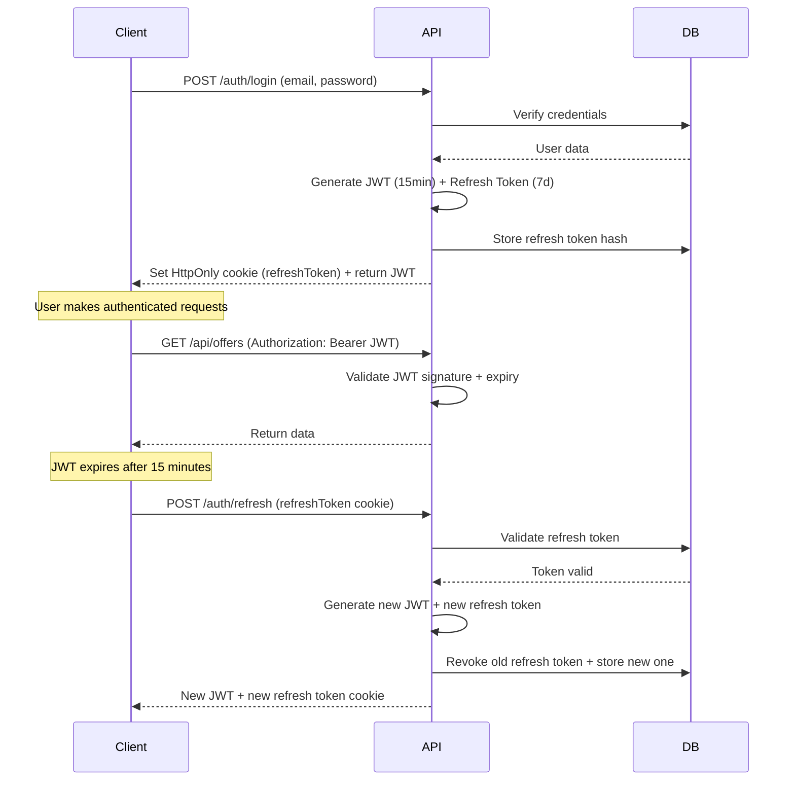
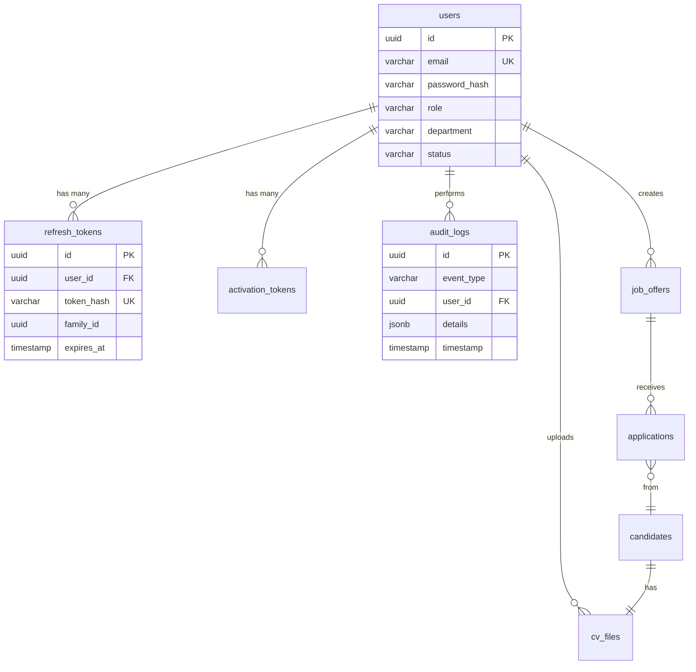

y# Authentication & Authorization Architecture
**Orange ISS - Enterprise Job Marketplace**

## 1. Authentication Strategy

### Recommended Approach: **Email/Password with JWT + SSO Ready**

**Primary Method (Sprint 1):** Email/Password Authentication
- **Justification:**
  - **Hosting Constraints:** Orange infrastructure may have strict firewall/network policies that complicate OAuth integration with external providers
  - **Autonomy:** Full control over authentication flow without third-party dependencies
  - **Compliance:** Data sovereignty - all credentials stay within Orange infrastructure
  - **User Base:** Internal HR and Department Chiefs are known entities with controlled email domains (@orange.com)
  
**Future Extension (Sprint 2+):** SSO Integration
- **Protocol:** SAML 2.0 or OpenID Connect (OIDC)
- **Provider:** Orange Active Directory / Azure AD
- **Benefit:** Single sign-on with existing Orange corporate credentials
- **Architecture:** Design JWT system to be SSO-compatible from day one

### Security Posture
| Aspect | Implementation |
|--------|---------------|
| **Transport** | TLS 1.3 only, HSTS enabled |
| **Password Storage** | Argon2id (memory-hard, resistant to GPU attacks) |
| **Token Security** | Short-lived JWT (15 min) + secure refresh tokens (7 days) |
| **Session Management** | HttpOnly, Secure, SameSite cookies |

---

## 2. Identity & Roles

### User Identity Schema

```typescript
interface User {
  id: string;                    // UUID v4
  email: string;                 // Unique, must match @orange.com domain
  firstName: string;
  lastName: string;
  role: UserRole;                // Enum: HR_ADMIN, DEPT_CHIEF
  department: string | null;     // Required for DEPT_CHIEF, null for HR_ADMIN
  status: AccountStatus;         // Enum: PENDING, ACTIVE, SUSPENDED, LOCKED
  phoneNumber: string | null;    // Optional, for MFA future implementation
  lastLogin: Date | null;
  failedLoginAttempts: number;
  accountLockedUntil: Date | null;
  passwordChangedAt: Date;
  createdAt: Date;
  updatedAt: Date;
  createdBy: string | null;      // User ID of creator (for audit)
}
```

### Role Model

```typescript
enum UserRole {
  HR_ADMIN = 'HR_ADMIN',           // Human Resources Administrator
  DEPT_CHIEF = 'DEPT_CHIEF',       // Department Chief/Manager
  SUPER_ADMIN = 'SUPER_ADMIN',     // System administrator (future)
  RECRUITER = 'RECRUITER'          // Specialized recruiter role (future)
}
```

**Role Hierarchy:**
- **HR_ADMIN:** Full access to all departments, candidate management, analytics, exports
- **DEPT_CHIEF:** Department-scoped access, can post offers and view candidates for their department only
- **SUPER_ADMIN (future):** Platform administration, user management, system configuration
- **RECRUITER (future):** Cross-department recruitment support role

### Account Lifecycle

#### 1. **Account Creation**
```
Trigger: HR creates new user via admin panel
Flow:
  1. HR_ADMIN submits creation form (email, firstName, lastName, role, department)
  2. System validates email domain (@orange.com)
  3. Creates user with status=PENDING
  4. Generates secure random token (256-bit, expires in 48h)
  5. Sends activation email with link: https://iss.orange.com/activate?token=XXX
  6. Stores token hash in database
```

#### 2. **Account Activation**
```
Flow:
  1. User clicks activation link
  2. System validates token (not expired, not used)
  3. User sets password (must meet policy)
  4. System hashes password with Argon2id
  5. Updates status=ACTIVE, invalidates activation token
  6. Redirects to login page
```

#### 3. **Password Reset**
```
Trigger: User clicks "Forgot Password"
Flow:
  1. User enters email
  2. System validates email exists and account is ACTIVE
  3. Generates reset token (256-bit, expires in 1h)
  4. Sends reset email (rate-limited: 1 per 10 minutes)
  5. User sets new password
  6. System invalidates all existing refresh tokens
  7. Forces re-login on all devices
```

#### 4. **Account Suspension**
```
Trigger: HR_ADMIN or SUPER_ADMIN action
Flow:
  1. Admin marks user status=SUSPENDED
  2. System invalidates all refresh tokens immediately
  3. JWT validation middleware rejects tokens for suspended users
  4. Audit log records suspension with reason
  5. User receives notification email
```

#### 5. **Account Lockout (Brute Force)**
```
Trigger: 5 failed login attempts within 15 minutes
Flow:
  1. System sets accountLockedUntil = now + 30 minutes
  2. Blocks all login attempts during lockout period
  3. Sends security alert email to user
  4. Auto-unlocks after 30 minutes OR admin manual unlock
```

---

## 3. Authorization Rules (RBAC)

### Permission Matrix

| Feature / Action | HR_ADMIN | DEPT_CHIEF | Notes |
|------------------|----------|------------|-------|
| **Job Offers** |
| Post new offer | ✅ All depts | ✅ Own dept only | DEPT_CHIEF restricted to their department |
| Edit offer | ✅ All depts | ✅ Own dept + status=DRAFT | Cannot edit published offers from other depts |
| Delete offer | ✅ All depts | ✅ Own dept + no applications | Cannot delete if candidates applied |
| Validate offer | ✅ All depts | ❌ | Only HR can approve/publish offers |
| Decline offer | ✅ All depts | ❌ | Only HR can reject offers |
| **Candidates** |
| View applications | ✅ All depts | ✅ Own dept only | Department-scoped access |
| View candidate CV | ✅ All depts | ✅ Own dept only | Generates signed download URL |
| Shortlist candidate | ✅ All depts | ✅ Own dept only | Updates application status |
| Download CV | ✅ All depts | ✅ Own dept only | Audit logged |
| Export candidates (PDF) | ✅ All depts | ✅ Own dept only | Department filter applied |
| Export candidates (Excel) | ✅ All depts | ✅ Own dept only | Department filter applied |
| **Dashboard & Analytics** |
| View HR dashboard | ✅ | ❌ | HR-only view with all departments |
| View department dashboard | ✅ All depts | ✅ Own dept only | Scoped metrics |
| View reports | ✅ | ✅ Own dept only | Pre-filtered by department |
| **Pipeline Management** |
| Set global deadlines | ✅ | ❌ | HR sets company-wide deadlines |
| Manage hiring stages | ✅ All depts | ✅ Own dept only | Configure pipeline stages |
| Move candidates between stages | ✅ All depts | ✅ Own dept only | Update application status |
| **User Management** |
| Create users | ✅ | ❌ | HR creates DEPT_CHIEF accounts |
| Suspend/activate users | ✅ | ❌ | HR manages account lifecycle |
| Reset user password | ✅ | ❌ Self only | Users can reset their own via email |
| View audit logs | ✅ | ❌ | Security monitoring |

### Least-Privilege Rules

1. **Department Scoping:**
   ```sql
   -- DEPT_CHIEF can only access offers where department matches their assignment
   WHERE (user.role = 'HR_ADMIN' OR offer.department = user.department)
   ```

2. **Draft vs Published Offers:**
   ```typescript
   canEditOffer(user: User, offer: Offer): boolean {
     if (user.role === 'HR_ADMIN') return true;
     if (user.role === 'DEPT_CHIEF') {
       return offer.department === user.department && 
              offer.status === 'DRAFT';
     }
     return false;
   }
   ```

3. **Cascade Protection:**
   - DEPT_CHIEF cannot delete offers with existing applications
   - HR can delete but only with explicit confirmation + cascade to anonymize candidate data

### Edge Cases

| Scenario | Resolution |
|----------|-----------|
| Dept Chief changes department | All offers remain with old department, no automatic transfer |
| Dept Chief promoted to HR | Role upgrade, removes department constraint |
| Offer has no department (legacy) | Only HR_ADMIN can access |
| User suspended mid-session | Next API call fails with 401, forces logout |
| JWT valid but refresh token revoked | JWT works until expiry, refresh fails, forces re-login |
| Two HR admins edit same offer | Last-write-wins, optimistic locking with version field |

---

## 4. Token & Session Design

### Token Architecture

```typescript
// Access Token (JWT) - Short-lived
interface AccessTokenPayload {
  sub: string;              // User ID (UUID)
  email: string;
  role: UserRole;
  department: string | null;
  iat: number;              // Issued at (Unix timestamp)
  exp: number;              // Expires at (iat + 15 minutes)
  jti: string;              // JWT ID (for revocation tracking)
}

// Refresh Token - Long-lived, stored in database
interface RefreshToken {
  id: string;               // UUID v4
  userId: string;           // Foreign key to users
  tokenHash: string;        // SHA-256 hash of token
  familyId: string;         // Token family for rotation detection
  expiresAt: Date;          // 7 days from creation
  createdAt: Date;
  revokedAt: Date | null;
  ipAddress: string;
  userAgent: string;
}
```

### Token Flow



### Token Rotation Policy

**Automatic Rotation:**
- Every refresh generates a NEW refresh token
- Old refresh token is immediately revoked
- Token family ID tracks rotation chain

**Reuse Detection:**
```typescript
async refresh(oldToken: string): Promise<Tokens> {
  const tokenRecord = await db.findRefreshToken(oldToken);
  
  if (tokenRecord.revokedAt !== null) {
    // Token already used - potential attack
    // Revoke entire token family
    await db.revokeTokenFamily(tokenRecord.familyId);
    throw new UnauthorizedException('Token reuse detected');
  }
  
  // Normal flow: revoke old, issue new
  await db.revokeToken(oldToken);
  const newTokens = await this.generateTokens(tokenRecord.userId);
  return newTokens;
}
```

### Secure Storage - Angular Frontend

**Recommended Approach: Hybrid Storage**

| Token Type | Storage Location | Rationale |
|-----------|------------------|-----------|
| **Access Token (JWT)** | `localStorage` | Needs to be accessible to Angular for Authorization headers |
| **Refresh Token** | **HttpOnly Cookie** | Not accessible to JavaScript, prevents XSS theft |

**Implementation:**

```typescript
// Backend sets refresh token as HttpOnly cookie
@Post('login')
async login(@Res({ passthrough: true }) response: Response) {
  const { accessToken, refreshToken } = await this.authService.login(credentials);
  
  // Set refresh token as secure cookie
  response.cookie('refreshToken', refreshToken, {
    httpOnly: true,      // Not accessible via JavaScript
    secure: true,        // HTTPS only
    sameSite: 'strict',  // CSRF protection
    maxAge: 7 * 24 * 60 * 60 * 1000, // 7 days
    path: '/api/auth/refresh' // Only sent to refresh endpoint
  });
  
  return { accessToken }; // JWT returned in body
}

// Frontend stores JWT in localStorage
// frontend/src/app/services/auth.service.ts
login(credentials): Observable<void> {
  return this.http.post<{accessToken: string}>('/api/auth/login', credentials)
    .pipe(
      tap(({ accessToken }) => {
        localStorage.setItem('access_token', accessToken);
        this.decodeAndStoreUser(accessToken);
      })
    );
}

// Refresh happens automatically via httpOnly cookie
refreshToken(): Observable<{accessToken: string}> {
  // Cookie sent automatically by browser
  return this.http.post<{accessToken: string}>('/api/auth/refresh', {}, {
    withCredentials: true // Ensures cookies are sent
  });
}
```

### CSRF Protection Strategy

**Why it's needed:** HttpOnly cookies are automatically sent by browser, vulnerable to CSRF attacks.

**Implementation: SameSite + Double Submit Cookie**

```typescript
// 1. SameSite=Strict (primary defense)
response.cookie('refreshToken', token, {
  sameSite: 'strict', // Browser won't send cookie on cross-site requests
});

// 2. CSRF Token for refresh endpoint (defense in depth)
@Post('refresh')
@UseGuards(CsrfGuard)
async refresh(@Req() req: Request) {
  const refreshToken = req.cookies['refreshToken'];
  // Validate CSRF token from header
  return this.authService.refresh(refreshToken);
}

// Angular HTTP interceptor adds CSRF token
export class CsrfInterceptor implements HttpInterceptor {
  intercept(req: HttpRequest<any>, next: HttpHandler) {
    const csrfToken = this.getStoredCsrfToken();
    if (csrfToken && req.url.includes('/auth/refresh')) {
      req = req.clone({
        headers: req.headers.set('X-CSRF-Token', csrfToken)
      });
    }
    return next.handle(req);
  }
}
```

---

## 5. Security Controls

### Password Policy

**Requirements:**
- **Minimum Length:** 12 characters
- **Complexity:** At least 3 of 4 categories (uppercase, lowercase, numbers, symbols)
- **Blacklist:** Common passwords (top 10,000 list), user's email/name
- **History:** Cannot reuse last 5 passwords
- **Expiration:** 90 days for HR_ADMIN, 180 days for DEPT_CHIEF

**Validation:**
```typescript
// backend/src/auth/validators/password.validator.ts
export class PasswordValidator {
  private static BLACKLIST = ['Password123', 'Orange2024', ...]; // Load from file
  
  static validate(password: string, user: User): ValidationResult {
    const errors = [];
    
    // Length check
    if (password.length < 12) {
      errors.push('Password must be at least 12 characters');
    }
    
    // Complexity check
    const hasUppercase = /[A-Z]/.test(password);
    const hasLowercase = /[a-z]/.test(password);
    const hasNumbers = /[0-9]/.test(password);
    const hasSymbols = /[^A-Za-z0-9]/.test(password);
    const complexity = [hasUppercase, hasLowercase, hasNumbers, hasSymbols]
      .filter(Boolean).length;
    
    if (complexity < 3) {
      errors.push('Password must include at least 3 of: uppercase, lowercase, numbers, symbols');
    }
    
    // Blacklist check
    if (this.BLACKLIST.includes(password)) {
      errors.push('This password is too common');
    }
    
    // Personal info check
    if (password.toLowerCase().includes(user.email.split('@')[0].toLowerCase())) {
      errors.push('Password cannot contain your email address');
    }
    
    return { valid: errors.length === 0, errors };
  }
}
```

### Hashing: Argon2id

**Configuration:**
```typescript
// backend/src/auth/services/password.service.ts
import * as argon2 from 'argon2';

export class PasswordService {
  private static readonly ARGON2_OPTIONS = {
    type: argon2.argon2id,    // Hybrid mode (resistant to side-channel + GPU attacks)
    memoryCost: 65536,        // 64 MB
    timeCost: 3,              // 3 iterations
    parallelism: 4,           // 4 threads
    hashLength: 32            // 256-bit output
  };
  
  async hash(password: string): Promise<string> {
    return argon2.hash(password, this.ARGON2_OPTIONS);
  }
  
  async verify(hash: string, password: string): Promise<boolean> {
    try {
      return await argon2.verify(hash, password);
    } catch (error) {
      return false;
    }
  }
}
```

**Why Argon2id over bcrypt:**
- **Memory-hard:** Requires 64 MB RAM per hash, GPU cracking economically infeasible
- **Future-proof:** Winner of Password Hashing Competition (2015)
- **Side-channel resistant:** Constant-time operations

### MFA Recommendation (Sprint 2)

**Approach:** TOTP (Time-based One-Time Password) - RFC 6238

**Workflow:**
1. User enables MFA in profile settings
2. Backend generates secret key, displays QR code
3. User scans with Google Authenticator / Microsoft Authenticator
4. User verifies with test code
5. Backend stores encrypted secret key in database
6. Login flow: password → TOTP code → JWT issued

**Database Extension:**
```sql
ALTER TABLE users ADD COLUMN mfa_secret VARCHAR(255);
ALTER TABLE users ADD COLUMN mfa_enabled BOOLEAN DEFAULT false;
```

### Rate Limiting

**Strategy: Token Bucket Algorithm**

| Endpoint | Limit | Burst | Lockout |
|----------|-------|-------|---------|
| `/auth/login` | 5 attempts / 15 min | 2 | 30 min after 5 failures |
| `/auth/refresh` | 10 requests / 1 min | 5 | N/A |
| `/auth/password-reset` | 3 requests / 10 min | 0 | N/A |
| `/api/*` (authenticated) | 100 requests / 1 min | 20 | N/A |

**Implementation:**
```typescript
// backend/src/common/guards/rate-limit.guard.ts
import { ThrottlerGuard } from '@nestjs/throttler';

@Injectable()
export class LoginRateLimitGuard extends ThrottlerGuard {
  protected async getTracker(req: Request): Promise<string> {
    // Track by IP + email (prevents distributed attack on single account)
    const email = req.body.email || '';
    return `${req.ip}-${email}`;
  }
}

// Apply to login route
@Post('login')
@UseGuards(LoginRateLimitGuard)
async login(@Body() credentials: LoginDto) {
  // ...
}
```

### Account Lockout Rules

**Triggers:**
1. **5 failed login attempts** within 15 minutes → 30-minute lockout
2. **3 lockouts in 24 hours** → Manual unlock required (HR admin action)
3. **Password reset** → Immediate unlock

**Unlock Methods:**
1. **Automatic:** Wait for lockout period to expire
2. **Manual:** HR_ADMIN clicks "Unlock Account" in user management panel
3. **Self-service:** User clicks "Forgot Password" (resets lockout counter)

**Database Tracking:**
```typescript
interface LockoutTracking {
  failedLoginAttempts: number;     // Current failure count
  accountLockedUntil: Date | null; // Null if not locked
  lockoutCount24h: number;         // Number of lockouts in last 24 hours
  lastFailedLogin: Date;           // For rate calculation
}
```

---

## 6. File Upload Security (CVs)

### Validation Pipeline

```typescript
// backend/src/candidates/services/cv-upload.service.ts
export class CVUploadService {
  private static readonly ALLOWED_TYPES = [
    'application/pdf',
    'application/msword',
    'application/vnd.openxmlformats-officedocument.wordprocessingml.document'
  ];
  
  private static readonly MAX_SIZE = 5 * 1024 * 1024; // 5 MB
  
  async validateFile(file: Express.Multer.File): Promise<void> {
    // 1. Size validation
    if (file.size > this.MAX_SIZE) {
      throw new BadRequestException('File size exceeds 5 MB limit');
    }
    
    // 2. MIME type validation (check header, not extension)
    const fileType = await FileType.fromBuffer(file.buffer);
    if (!this.ALLOWED_TYPES.includes(fileType?.mime)) {
      throw new BadRequestException('Invalid file type. Only PDF and DOC files allowed');
    }
    
    // 3. Extension validation (prevent double extension attacks)
    const ext = file.originalname.split('.').pop()?.toLowerCase();
    if (!['pdf', 'doc', 'docx'].includes(ext)) {
      throw new BadRequestException('Invalid file extension');
    }
    
    // 4. Filename sanitization
    file.originalname = this.sanitizeFilename(file.originalname);
    
    // 5. Malware scan (ClamAV integration)
    await this.scanForMalware(file.buffer);
  }
  
  private sanitizeFilename(filename: string): string {
    return filename
      .replace(/[^a-zA-Z0-9.-]/g, '_') // Remove special characters
      .substring(0, 100); // Limit length
  }
}
```

### Antivirus Scanning (ClamAV)

**Docker Compose Integration:**
```yaml
# docker-compose.yml
services:
  clamav:
    image: clamav/clamav:latest
    container_name: clamav
    ports:
      - "3310:3310"
    volumes:
      - clamav-data:/var/lib/clamav
    healthcheck:
      test: ["CMD", "clamdscan", "--version"]
      interval: 30s
      timeout: 10s
      retries: 3
```

**Integration:**
```typescript
import NodeClam from 'clamscan';

async scanForMalware(fileBuffer: Buffer): Promise<void> {
  const clam = new NodeClam().init({
    clamdscan: {
      host: 'clamav',
      port: 3310
    }
  });
  
  const { isInfected, viruses } = await clam.scanBuffer(fileBuffer);
  
  if (isInfected) {
    this.logger.warn(`Malware detected: ${viruses.join(', ')}`);
    throw new BadRequestException('File contains malware and was rejected');
  }
}
```

### Secure Storage

**Storage Path Strategy:**
```
/var/uploads/
  └── {year}/
      └── {month}/
          └── {uuid}.{ext}

Example: /var/uploads/2026/02/a7f3d9e1-4b2c-4f7a-9c3e-8d6f4a2b7c9e.pdf
```

**Storage Service:**
```typescript
// backend/src/storage/storage.service.ts
export class StorageService {
  private readonly uploadPath = process.env.UPLOAD_PATH || '/var/uploads';
  
  async saveCV(file: Express.Multer.File, candidateId: string): Promise<string> {
    const date = new Date();
    const year = date.getFullYear();
    const month = String(date.getMonth() + 1).padStart(2, '0');
    const uuid = uuidv4();
    const ext = path.extname(file.originalname);
    
    // Create directory structure
    const dirPath = path.join(this.uploadPath, String(year), month);
    await fs.promises.mkdir(dirPath, { recursive: true });
    
    // Save file with UUID name
    const filename = `${uuid}${ext}`;
    const filepath = path.join(dirPath, filename);
    await fs.promises.writeFile(filepath, file.buffer, { mode: 0o600 }); // Read/write owner only
    
    // Store metadata in database
    await this.db.cvFiles.create({
      id: uuid,
      candidateId,
      originalName: file.originalname,
      storagePath: filepath,
      mimeType: file.mimetype,
      size: file.size,
      uploadedAt: new Date(),
      uploadedBy: this.currentUser.id
    });
    
    return uuid; // Return file ID, not path
  }
}
```

### Access Control & Signed URLs

**Protected Download Endpoint:**
```typescript
// backend/src/candidates/candidates.controller.ts
@Get('/:candidateId/cv/:fileId/download')
@UseGuards(JwtAuthGuard, RolesGuard)
@Roles('HR_ADMIN', 'DEPT_CHIEF')
async downloadCV(
  @Param('candidateId') candidateId: string,
  @Param('fileId') fileId: string,
  @CurrentUser() user: User,
  @Res() response: Response
) {
  // 1. Authorization check
  const candidate = await this.candidatesService.findOne(candidateId);
  if (user.role === 'DEPT_CHIEF' && candidate.department !== user.department) {
    throw new ForbiddenException('You can only access CVs from your department');
  }
  
  // 2. Audit log
  await this.auditService.log({
    action: 'CV_DOWNLOAD',
    userId: user.id,
    candidateId,
    fileId,
    ipAddress: request.ip,
    timestamp: new Date()
  });
  
  // 3. Retrieve file
  const file = await this.storageService.getFile(fileId);
  
  // 4. Stream file to client
  response.setHeader('Content-Type', file.mimeType);
  response.setHeader('Content-Disposition', `attachment; filename="${file.originalName}"`);
  const fileStream = fs.createReadStream(file.storagePath);
  fileStream.pipe(response);
}
```

**Alternative: Signed URLs (15-minute expiry):**
```typescript
// Generate signed download URL
async generateSignedUrl(fileId: string): Promise<string> {
  const payload = {
    fileId,
    exp: Math.floor(Date.now() / 1000) + 900 // 15 minutes
  };
  
  const token = jwt.sign(payload, process.env.FILE_SIGNING_SECRET);
  return `/api/files/download?token=${token}`;
}

// Validate and serve file
@Get('download')
async downloadWithToken(@Query('token') token: string, @Res() response: Response) {
  try {
    const { fileId } = jwt.verify(token, process.env.FILE_SIGNING_SECRET);
    const file = await this.storageService.getFile(fileId);
    // Stream file...
  } catch (error) {
    throw new UnauthorizedException('Invalid or expired download link');
  }
}
```

---

## 7. Audit & Logging

### Audit Events

**High-Priority Events:**
| Event | Logged Data | Retention |
|-------|-------------|-----------|
| `USER_LOGIN` | userId, email, ipAddress, userAgent, timestamp, success | 12 months |
| `USER_LOGOUT` | userId, ipAddress, timestamp | 6 months |
| `LOGIN_FAILED` | email, ipAddress, reason, timestamp | 12 months |
| `PASSWORD_CHANGED` | userId, changedBy (self/admin), ipAddress, timestamp | Indefinite |
| `PASSWORD_RESET_REQUEST` | email, ipAddress, timestamp | 6 months |
| `ACCOUNT_CREATED` | userId, email, role, createdBy, timestamp | Indefinite |
| `ACCOUNT_SUSPENDED` | userId, suspendedBy, reason, timestamp | Indefinite |
| `ROLE_CHANGED` | userId, oldRole, newRole, changedBy, timestamp | Indefinite |
| `CV_DOWNLOADED` | userId, candidateId, fileId, ipAddress, timestamp | 24 months |
| `OFFER_CREATED` | offerId, createdBy, department, timestamp | Indefinite |
| `OFFER_VALIDATED` | offerId, validatedBy, timestamp | Indefinite |
| `CANDIDATE_DATA_ACCESSED` | userId, candidateId, accessType, timestamp | 24 months |
| `EXPORT_GENERATED` | userId, exportType (PDF/Excel), recordCount, timestamp | 12 months |

**Implementation:**
```typescript
// backend/src/audit/audit.service.ts
export class AuditService {
  async log(event: AuditEvent): Promise<void> {
    await this.db.auditLogs.create({
      id: uuidv4(),
      eventType: event.action,
      userId: event.userId,
      targetId: event.targetId, // candidateId, offerId, etc.
      details: JSON.stringify(event.details),
      ipAddress: event.ipAddress,
      userAgent: event.userAgent,
      timestamp: new Date()
    });
    
    // High-severity events trigger real-time alerts
    if (this.isHighSeverity(event)) {
      await this.sendSecurityAlert(event);
    }
  }
  
  private isHighSeverity(event: AuditEvent): boolean {
    return [
      'ACCOUNT_SUSPENDED',
      'MULTIPLE_FAILED_LOGINS',
      'UNAUTHORIZED_ACCESS_ATTEMPT'
    ].includes(event.action);
  }
}

// Apply via decorator
@Post('login')
@AuditLog('USER_LOGIN')
async login(@Body() credentials: LoginDto, @Req() request: Request) {
  // Implementation...
}
```

### GDPR / Privacy Considerations

**Compliance Requirements:**

1. **Right to Access:**
   - Users can request all audit logs related to their account
   - Endpoint: `GET /api/users/me/audit-logs`

2. **Right to Erasure (Right to be Forgotten):**
   - Candidate data can be deleted after recruitment cycle
   - Audit logs retain user actions but anonymize personal data
   ```sql
   -- Anonymization script
   UPDATE candidates 
   SET firstName = 'DELETED',
       lastName = 'USER',
       email = CONCAT('deleted-', id, '@anonymized.local'),
       phoneNumber = NULL,
       cvFileId = NULL  -- Delete CV file from storage
   WHERE id = @candidateId;
   ```

3. **Data Minimization:**
   - Only log necessary fields (avoid logging passwords, full CVs in logs)
   - IP addresses hashed after 90 days

4. **Data Retention Policy:**
   ```typescript
   // backend/src/audit/retention.service.ts
   async applyRetentionPolicy(): Promise<void> {
     const retentionRules = {
       'USER_LOGIN': 365,        // 12 months
       'CV_DOWNLOADED': 730,     // 24 months
       'USER_LOGOUT': 180        // 6 months
     };
     
     for (const [eventType, days] of Object.entries(retentionRules)) {
       const cutoffDate = new Date();
       cutoffDate.setDate(cutoffDate.getDate() - days);
       
       await this.db.auditLogs.deleteMany({
         eventType,
         timestamp: { $lt: cutoffDate }
       });
     }
   }
   ```

5. **Pseudonymization:**
   - Candidate emails encrypted at rest
   - Reversible only with encryption key stored in secure vault

**Legal Basis:** Legitimate interest for security monitoring + contractual necessity for recruitment process.

---

## 8. Database Schema (PostgreSQL)

### Core Tables

#### `users`
```sql
CREATE TABLE users (
  id UUID PRIMARY KEY DEFAULT gen_random_uuid(),
  email VARCHAR(255) UNIQUE NOT NULL,
  password_hash VARCHAR(255) NOT NULL,
  first_name VARCHAR(100) NOT NULL,
  last_name VARCHAR(100) NOT NULL,
  role VARCHAR(50) NOT NULL CHECK (role IN ('HR_ADMIN', 'DEPT_CHIEF', 'SUPER_ADMIN', 'RECRUITER')),
  department VARCHAR(100),
  status VARCHAR(50) NOT NULL DEFAULT 'PENDING' CHECK (status IN ('PENDING', 'ACTIVE', 'SUSPENDED', 'LOCKED')),
  phone_number VARCHAR(20),
  last_login TIMESTAMP,
  failed_login_attempts INTEGER DEFAULT 0,
  account_locked_until TIMESTAMP,
  lockout_count_24h INTEGER DEFAULT 0,
  last_lockout_reset TIMESTAMP DEFAULT NOW(),
  password_changed_at TIMESTAMP DEFAULT NOW(),
  password_history TEXT[], -- Array of last 5 password hashes
  mfa_secret VARCHAR(255),
  mfa_enabled BOOLEAN DEFAULT false,
  created_at TIMESTAMP DEFAULT NOW(),
  updated_at TIMESTAMP DEFAULT NOW(),
  created_by UUID REFERENCES users(id),
  
  CONSTRAINT email_domain CHECK (email LIKE '%@orange.com'),
  CONSTRAINT dept_chief_needs_dept CHECK (role != 'DEPT_CHIEF' OR department IS NOT NULL)
);

CREATE INDEX idx_users_email ON users(email);
CREATE INDEX idx_users_role ON users(role);
CREATE INDEX idx_users_status ON users(status);
```

#### `refresh_tokens`
```sql
CREATE TABLE refresh_tokens (
  id UUID PRIMARY KEY DEFAULT gen_random_uuid(),
  user_id UUID NOT NULL REFERENCES users(id) ON DELETE CASCADE,
  token_hash VARCHAR(64) NOT NULL UNIQUE, -- SHA-256 hash
  family_id UUID NOT NULL, -- For rotation tracking
  expires_at TIMESTAMP NOT NULL,
  created_at TIMESTAMP DEFAULT NOW(),
  revoked_at TIMESTAMP,
  ip_address VARCHAR(45), -- IPv6 compatible
  user_agent TEXT,
  
  CONSTRAINT valid_expiry CHECK (expires_at > created_at)
);

CREATE INDEX idx_refresh_tokens_user_id ON refresh_tokens(user_id);
CREATE INDEX idx_refresh_tokens_token_hash ON refresh_tokens(token_hash);
CREATE INDEX idx_refresh_tokens_family_id ON refresh_tokens(family_id);
CREATE INDEX idx_refresh_tokens_expires_at ON refresh_tokens(expires_at) WHERE revoked_at IS NULL;
```

#### `activation_tokens`
```sql
CREATE TABLE activation_tokens (
  id UUID PRIMARY KEY DEFAULT gen_random_uuid(),
  user_id UUID NOT NULL REFERENCES users(id) ON DELETE CASCADE,
  token_hash VARCHAR(64) NOT NULL UNIQUE,
  token_type VARCHAR(50) NOT NULL CHECK (token_type IN ('ACTIVATION', 'PASSWORD_RESET')),
  expires_at TIMESTAMP NOT NULL,
  created_at TIMESTAMP DEFAULT NOW(),
  used_at TIMESTAMP
);

CREATE INDEX idx_activation_tokens_token_hash ON activation_tokens(token_hash);
CREATE INDEX idx_activation_tokens_user_id ON activation_tokens(user_id);
```

#### `audit_logs`
```sql
CREATE TABLE audit_logs (
  id UUID PRIMARY KEY DEFAULT gen_random_uuid(),
  event_type VARCHAR(100) NOT NULL,
  user_id UUID REFERENCES users(id) ON DELETE SET NULL,
  target_id UUID, -- Generic reference (candidateId, offerId, etc.)
  details JSONB, -- Flexible storage for event-specific data
  ip_address VARCHAR(45),
  user_agent TEXT,
  timestamp TIMESTAMP DEFAULT NOW(),
  severity VARCHAR(20) DEFAULT 'INFO' CHECK (severity IN ('INFO', 'WARNING', 'ERROR', 'CRITICAL'))
);

CREATE INDEX idx_audit_logs_event_type ON audit_logs(event_type);
CREATE INDEX idx_audit_logs_user_id ON audit_logs(user_id);
CREATE INDEX idx_audit_logs_timestamp ON audit_logs(timestamp);
CREATE INDEX idx_audit_logs_severity ON audit_logs(severity) WHERE severity IN ('ERROR', 'CRITICAL');
```

#### `cv_files`
```sql
CREATE TABLE cv_files (
  id UUID PRIMARY KEY DEFAULT gen_random_uuid(),
  candidate_id UUID NOT NULL REFERENCES candidates(id) ON DELETE CASCADE,
  original_name VARCHAR(255) NOT NULL,
  storage_path VARCHAR(500) NOT NULL,
  mime_type VARCHAR(100) NOT NULL,
  file_size INTEGER NOT NULL,
  uploaded_at TIMESTAMP DEFAULT NOW(),
  uploaded_by UUID REFERENCES users(id),
  virus_scan_status VARCHAR(50) DEFAULT 'PENDING' CHECK (virus_scan_status IN ('PENDING', 'CLEAN', 'INFECTED')),
  virus_scan_at TIMESTAMP,
  
  CONSTRAINT valid_mime_type CHECK (mime_type IN (
    'application/pdf',
    'application/msword',
    'application/vnd.openxmlformats-officedocument.wordprocessingml.document'
  ))
);

CREATE INDEX idx_cv_files_candidate_id ON cv_files(candidate_id);
CREATE INDEX idx_cv_files_uploaded_by ON cv_files(uploaded_by);
```

### Entity Relationships



### Indexes & Performance

**Query Optimization:**
```sql
-- Composite index for department-scoped queries (DEPT_CHIEF)
CREATE INDEX idx_offers_dept_status ON job_offers(department, status) 
  WHERE status IN ('DRAFT', 'PUBLISHED');

-- Partial index for active users only
CREATE INDEX idx_users_active ON users(id, role, department) 
  WHERE status = 'ACTIVE';

-- Covering index for login lookup
CREATE INDEX idx_users_login ON users(email, password_hash, status, role);
```

**Estimated Query Times (1M users, 100K offers):**
- Login lookup: < 5ms
- Department-scoped offer list: < 10ms
- Audit log search (30 days): < 50ms

---

## 9. API Design (NestJS)

### Authentication Endpoints

#### `POST /api/auth/register` (Admin Only)
**Purpose:** HR creates new user account  
**Auth:** Requires JWT + HR_ADMIN role  
**Request:**
```typescript
{
  email: string;         // Must be @orange.com
  firstName: string;
  lastName: string;
  role: 'HR_ADMIN' | 'DEPT_CHIEF';
  department?: string;   // Required if role is DEPT_CHIEF
}
```
**Response:**
```typescript
{
  userId: string;
  activationLink: string; // Sent via email
  expiresAt: string;      // ISO 8601 timestamp
}
```
**Status Codes:** `201 Created`, `400 Bad Request`, `403 Forbidden`

---

#### `POST /api/auth/activate`
**Purpose:** User activates account and sets password  
**Auth:** Public (requires activation token)  
**Request:**
```typescript
{
  token: string;         // From email link
  password: string;      // Must meet policy requirements
}
```
**Response:**
```typescript
{
  message: "Account activated successfully"
}
```
**Status Codes:** `200 OK`, `400 Bad Request`, `410 Gone` (expired token)

---

#### `POST /api/auth/login`
**Purpose:** User authentication  
**Auth:** Public  
**Request:**
```typescript
{
  email: string;
  password: string;
}
```
**Response:**
```typescript
{
  accessToken: string;   // JWT, 15-minute expiry
  user: {
    id: string;
    email: string;
    firstName: string;
    lastName: string;
    role: UserRole;
    department: string | null;
  }
}
```
**Headers:** Sets `refreshToken` HttpOnly cookie  
**Status Codes:** `200 OK`, `401 Unauthorized`, `423 Locked` (account locked)

---

#### `POST /api/auth/refresh`
**Purpose:** Obtain new access token using refresh token  
**Auth:** Requires valid refresh token cookie  
**Request:** Empty body  
**Response:**
```typescript
{
  accessToken: string;   // New JWT, 15-minute expiry
}
```
**Headers:** Sets new `refreshToken` HttpOnly cookie (rotation)  
**Status Codes:** `200 OK`, `401 Unauthorized`

---

#### `POST /api/auth/logout`
**Purpose:** Revoke refresh token and clear session  
**Auth:** Requires JWT  
**Request:** Empty body  
**Response:**
```typescript
{
  message: "Logged out successfully"
}
```
**Headers:** Clears `refreshToken` cookie  
**Status Codes:** `200 OK`

---

#### `GET /api/auth/me`
**Purpose:** Get current user profile  
**Auth:** Requires JWT  
**Response:**
```typescript
{
  id: string;
  email: string;
  firstName: string;
  lastName: string;
  role: UserRole;
  department: string | null;
  lastLogin: string;     // ISO 8601
  mfaEnabled: boolean;
}
```
**Status Codes:** `200 OK`, `401 Unauthorized`

---

#### `POST /api/auth/password-reset/request`
**Purpose:** Request password reset link  
**Auth:** Public  
**Rate Limit:** 3 requests per 10 minutes per IP  
**Request:**
```typescript
{
  email: string;
}
```
**Response:**
```typescript
{
  message: "If the email exists, a reset link has been sent"
}
```
**Note:** Always returns success to prevent email enumeration  
**Status Codes:** `200 OK`

---

#### `POST /api/auth/password-reset/confirm`
**Purpose:** Reset password using token  
**Auth:** Public (requires reset token)  
**Request:**
```typescript
{
  token: string;         // From email link
  newPassword: string;   // Must meet policy
}
```
**Response:**
```typescript
{
  message: "Password reset successfully"
}
```
**Side Effect:** Revokes all refresh tokens (forces re-login)  
**Status Codes:** `200 OK`, `400 Bad Request`, `410 Gone`

---

### Guards & Interceptors

#### `JwtAuthGuard`
```typescript
// backend/src/auth/guards/jwt-auth.guard.ts
@Injectable()
export class JwtAuthGuard extends AuthGuard('jwt') {
  canActivate(context: ExecutionContext) {
    return super.canActivate(context);
  }

  handleRequest(err, user, info) {
    if (err || !user) {
      throw new UnauthorizedException('Invalid or expired token');
    }
    
    // Check user account status
    if (user.status !== 'ACTIVE') {
      throw new UnauthorizedException('Account is not active');
    }
    
    return user;
  }
}
```

#### `RolesGuard`
```typescript
// backend/src/auth/guards/roles.guard.ts
@Injectable()
export class RolesGuard implements CanActivate {
  constructor(private reflector: Reflector) {}

  canActivate(context: ExecutionContext): boolean {
    const requiredRoles = this.reflector.get<UserRole[]>('roles', context.getHandler());
    if (!requiredRoles) {
      return true; // No role restriction
    }

    const { user } = context.switchToHttp().getRequest();
    return requiredRoles.includes(user.role);
  }
}

// Usage:
@Get('admin/users')
@UseGuards(JwtAuthGuard, RolesGuard)
@Roles('HR_ADMIN', 'SUPER_ADMIN')
async listUsers() {
  // Only HR_ADMIN or SUPER_ADMIN can access
}
```

#### `DepartmentGuard`
```typescript
// backend/src/auth/guards/department.guard.ts
@Injectable()
export class DepartmentGuard implements CanActivate {
  canActivate(context: ExecutionContext): boolean {
    const request = context.switchToHttp().getRequest();
    const user = request.user;
    const targetDepartment = request.params.department || request.body.department;

    // HR_ADMIN can access all departments
    if (user.role === 'HR_ADMIN') {
      return true;
    }

    // DEPT_CHIEF can only access their own department
    if (user.role === 'DEPT_CHIEF') {
      return user.department === targetDepartment;
    }

    return false;
  }
}
```

#### `AuditInterceptor`
```typescript
// backend/src/common/interceptors/audit.interceptor.ts
@Injectable()
export class AuditInterceptor implements NestInterceptor {
  constructor(private auditService: AuditService) {}

  intercept(context: ExecutionContext, next: CallHandler): Observable<any> {
    const request = context.switchToHttp().getRequest();
    const { user, method, url, ip, headers } = request;

    return next.handle().pipe(
      tap(() => {
        // Log successful requests
        this.auditService.log({
          action: 'API_REQUEST',
          userId: user?.id,
          details: { method, url },
          ipAddress: ip,
          userAgent: headers['user-agent']
        });
      }),
      catchError((error) => {
        // Log failed requests
        this.auditService.log({
          action: 'API_ERROR',
          userId: user?.id,
          details: { method, url, error: error.message },
          ipAddress: ip,
          severity: 'ERROR'
        });
        throw error;
      })
    );
  }
}
```

---

### Swagger Documentation

#### OpenAPI Configuration
```typescript
// backend/src/main.ts
const config = new DocumentBuilder()
  .setTitle('Orange ISS API')
  .setDescription('Internal Success Stories - Job Marketplace API')
  .setVersion('1.0')
  .addBearerAuth(
    { type: 'http', scheme: 'bearer', bearerFormat: 'JWT' },
    'access-token'
  )
  .addCookieAuth('refreshToken', {
    type: 'apiKey',
    in: 'cookie',
    name: 'refreshToken'
  })
  .addTag('auth', 'Authentication & Authorization')
  .addTag('offers', 'Job Offers Management')
  .addTag('candidates', 'Candidate Applications')
  .addTag('users', 'User Management (Admin)')
  .build();

const document = SwaggerModule.createDocument(app, config);
SwaggerModule.setup('api/docs', app, document);
```

#### Example Endpoint Documentation
```typescript
@ApiTags('auth')
@Controller('auth')
export class AuthController {
  
  @Post('login')
  @ApiOperation({ summary: 'User login', description: 'Authenticate with email and password' })
  @ApiBody({ type: LoginDto })
  @ApiResponse({ status: 200, description: 'Login successful', type: LoginResponseDto })
  @ApiResponse({ status: 401, description: 'Invalid credentials' })
  @ApiResponse({ status: 423, description: 'Account locked due to multiple failed attempts' })
  async login(@Body() credentials: LoginDto) {
    // Implementation
  }

  @Get('me')
  @UseGuards(JwtAuthGuard)
  @ApiBearerAuth('access-token')
  @ApiOperation({ summary: 'Get current user profile' })
  @ApiResponse({ status: 200, description: 'User profile', type: UserDto })
  @ApiResponse({ status: 401, description: 'Not authenticated' })
  async getCurrentUser(@CurrentUser() user: User) {
    return user;
  }
}
```

---

### Postman Collection Structure

**Collection Organization:**
```
Orange ISS API
├── 1. Authentication
│   ├── Login (Admin User)
│   ├── Login (Dept Chief)
│   ├── Refresh Token
│   ├── Get Current User
│   ├── Logout
│   ├── Request Password Reset
│   └── Confirm Password Reset
├── 2. User Management (Admin Only)
│   ├── Create User
│   ├── List Users
│   ├── Get User by ID
│   ├── Suspend User
│   └── Unlock Account
├── 3. Job Offers
│   ├── Create Offer (HR)
│   ├── Create Offer (Dept Chief)
│   ├── List All Offers (HR)
│   ├── List My Department Offers (Dept Chief)
│   ├── Validate Offer (HR)
│   └── Delete Offer
├── 4. Candidates
│   ├── Upload CV
│   ├── List Applications
│   ├── Download CV
│   ├── Export to PDF
│   └── Export to Excel
└── 5. Audit & Admin
    ├── View Audit Logs (Admin)
    └── View User Activity

Environments:
├── Local (http://localhost:3000)
├── Development (https://dev.iss.orange.com)
└── Production (https://iss.orange.com)
```

**Environment Variables:**
```json
{
  "baseUrl": "http://localhost:3000",
  "accessToken": "",
  "refreshToken": "",
  "testUserId": "",
  "testOfferId": ""
}
```

**Pre-request Script (Auto Token Refresh):**
```javascript
// Automatically refresh token if expired
const currentTime = Math.floor(Date.now() / 1000);
const tokenExpiry = pm.environment.get('tokenExpiry');

if (!tokenExpiry || currentTime >= tokenExpiry) {
    pm.sendRequest({
        url: pm.environment.get('baseUrl') + '/api/auth/refresh',
        method: 'POST',
        header: {
            'Content-Type': 'application/json'
        }
    }, function (err, res) {
        if (!err) {
            const newToken = res.json().accessToken;
            pm.environment.set('accessToken', newToken);
            const decoded = JSON.parse(atob(newToken.split('.')[1]));
            pm.environment.set('tokenExpiry', decoded.exp);
        }
    });
}
```

---

## 10. Implementation Checklist

### Sprint 1 (MVP - Week 1-2)
- [ ] Database schema creation (PostgreSQL)
- [ ] User entity + password hashing (Argon2id)
- [ ] JWT + refresh token system
- [ ] Login/logout endpoints
- [ ] Role-based guards (HR_ADMIN, DEPT_CHIEF)
- [ ] Password validation rules
- [ ] Account lockout mechanism
- [ ] Angular authentication service
- [ ] Login/signup components
- [ ] Auth interceptor (JWT injection)
- [ ] Route guards

### Sprint 2 (Security Hardening - Week 3)
- [ ] Rate limiting (login, refresh, password reset)
- [ ] CSRF protection for cookies
- [ ] Audit logging system
- [ ] Password reset flow
- [ ] Account activation flow
- [ ] File upload validation (CV)
- [ ] ClamAV integration
- [ ] Signed URL generation
- [ ] Swagger documentation
- [ ] Postman collection

### Sprint 3 (Advanced Features - Week 4)
- [ ] MFA (TOTP) implementation
- [ ] SSO integration (SAML/OIDC)
- [ ] Advanced audit dashboard
- [ ] GDPR compliance features
- [ ] Data retention policies
- [ ] Export audit logs
- [ ] User management UI (admin panel)
- [ ] Performance optimization (indexes)

---

## 11. Security Checklist

- [x] Passwords hashed with Argon2id (memory-hard)
- [x] JWT short-lived (15 min) + refresh tokens (7 days)
- [x] Refresh token rotation with reuse detection
- [x] HttpOnly cookies for refresh tokens
- [x] CSRF protection (SameSite + double submit)
- [x] Rate limiting on auth endpoints
- [x] Account lockout after 5 failed attempts
- [x] Password policy (12+ chars, complexity)
- [x] File upload validation (size, type, malware scan)
- [x] RBAC with department scoping
- [x] Audit logging for sensitive actions
- [x] TLS 1.3 only, HSTS enabled
- [x] Input sanitization (SQL injection, XSS)
- [x] Secure session management
- [x] Token revocation on password change
- [x] Signed URLs for file downloads
- [ ] MFA (Sprint 2)
- [ ] SSO integration (Sprint 3)

---

## 12. References & Resources

**Standards:**
- [OWASP Top 10 2021](https://owasp.org/Top10/)
- [OWASP Authentication Cheat Sheet](https://cheatsheetseries.owasp.org/cheatsheets/Authentication_Cheat_Sheet.html)
- [RFC 7519 - JSON Web Token (JWT)](https://datatracker.ietf.org/doc/html/rfc7519)
- [RFC 6238 - TOTP](https://datatracker.ietf.org/doc/html/rfc6238)
- [NIST Password Guidelines](https://pages.nist.gov/800-63-3/sp800-63b.html)

**Libraries:**
- NestJS: https://nestjs.com/
- Passport JWT: https://www.passportjs.org/packages/passport-jwt/
- Argon2: https://www.npmjs.com/package/argon2
- Node-ClamAV: https://www.npmjs.com/package/clamscan
- Angular Auth: https://angular.io/guide/security

**Compliance:**
- GDPR: https://gdpr-info.eu/
- ISO 27001: Information Security Management
- Orange Security Policies: [Internal Reference]

---

**Document Version:** 1.0  
**Last Updated:** February 8, 2026  
**Author:** GitHub Copilot  
**Status:** ✅ Ready for Review
